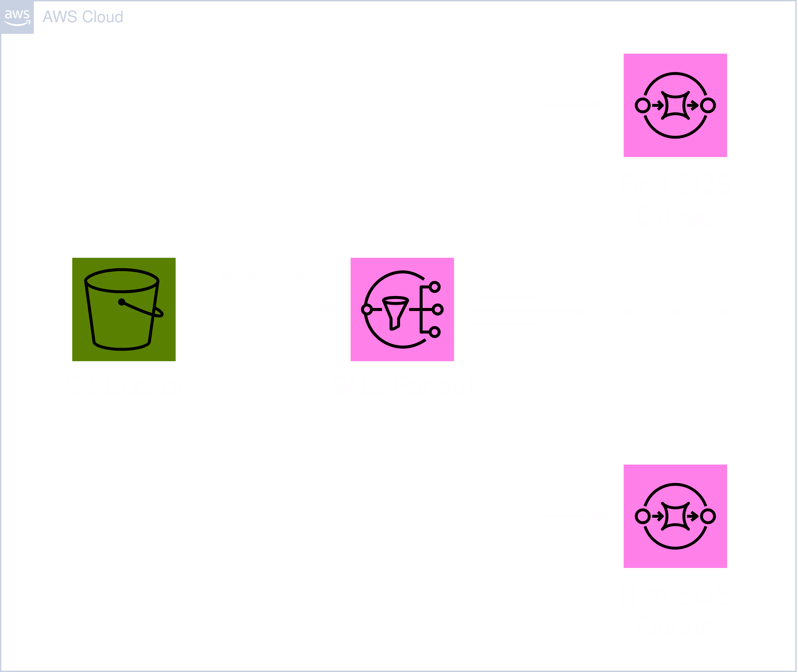

# Module: Bucket



This module provides a S3 bucket and multiple SQS queus which receive an event, triggered when an object gets created in the bucket.

## Contents

- [Requirements](#requirements)
- [Inputs](#inputs)
- [Outputs](#outputs)
- [Example](#example)
- [Contributing](#contributing)

## Requirements

| Name      | Version  |
| --------- | -------- |
| terraform | >= 1.0   |
| aws       | >= 5.20  |
| random    | >= 3.6.0 |

## Inputs

| Name          | Description                                                                                           | Type           | Default   | Required |
| ------------- | ----------------------------------------------------------------------------------------------------- | -------------- | --------- | :------: |
| identifier    | Unique identifier to differentiate global resources.                                                  | `string`       | n/a       |   yes    |
| force_destroy | A flag for wether or not being able to destroy a non empty bucket.                                    | `bool`         | true      |    no    |
| storage_class | Storage class of the S3 bucket. For example 'GLACIER' for a deep archive bucket.                      | `string`       | "DEFAULT" |    no    |
| queues        | A list of object to define SQS queues.                                                                | `list(object)` | []        |    no    |
| tags          | A map of tags to add to all resources. Name is always set as tag and the other tags will be appended. | `map(string)`  | {}        |    no    |

### `queues`

| Name                       | Description                                                                                                                | Type     | Default | Required |
| -------------------------- | -------------------------------------------------------------------------------------------------------------------------- | -------- | ------- | :------: |
| identifier                 | Unique identifier to differentiate global resources.                                                                       | `string` | n/a     |   yes    |
| message_retention_seconds  | The number of seconds Amazon SQS retains a message. Integer representing seconds, from 60 (1 minute) to 1209600 (14 days). | `number` | n/a     |   yes    |
| visibility_timeout_seconds | The visibility timeout for messages in the queue. An integer from 0 to 43200 (12 hours).                                   | `number` | n/a     |   yes    |
| max_receive_count          | Specifies how many times the same message can be received before moved into the deadletter queue.                          | `number` | n/a     |   yes    |

## Outputs

| Name   | Description                                          |
| ------ | ---------------------------------------------------- |
| id     | The ID of the S3 bucket.                             |
| arn    | The ARN of the S3 bucket.                            |
| uri    | The URI of the S3 bucket.                            |
| queues | List of objects with data of the created SQS queues. |

### `queues`

| Name | Description               |
| ---- | ------------------------- |
| url  | The URL of the SQS queue. |
| arn  | The ARN of the SQS queue. |

## Example

```hcl
module "bucket" {
  source = "github.com/custom-terraform-aws-modules/bucket"

  identifier    = "example-bucket-dev"
  force_destroy = true
  storage_class = "DEFAULT"

  queues = [
    {
      identifier                 = "example-bucket-queue-one-dev"
      message_retention_seconds  = 345600
      visibility_timeout_seconds = 300
      max_receive_count          = 4
    },
    {
      identifier                 = "example-bucket-queue-two-dev"
      message_retention_seconds  = 345600
      visibility_timeout_seconds = 300
      max_receive_count          = 4
    }
  ]

  tags = {
    Project     = "example-project"
    Environment = "dev"
  }
}
```

## Contributing

In order for a seamless CI workflow copy the `pre-commit` git hook from `.github/hooks` into your local `.git/hooks`. The hook formats the terraform code automatically before each commit.

```bash
cp ./.github/hooks/pre-commit ./.git/hooks/pre-commit
```
